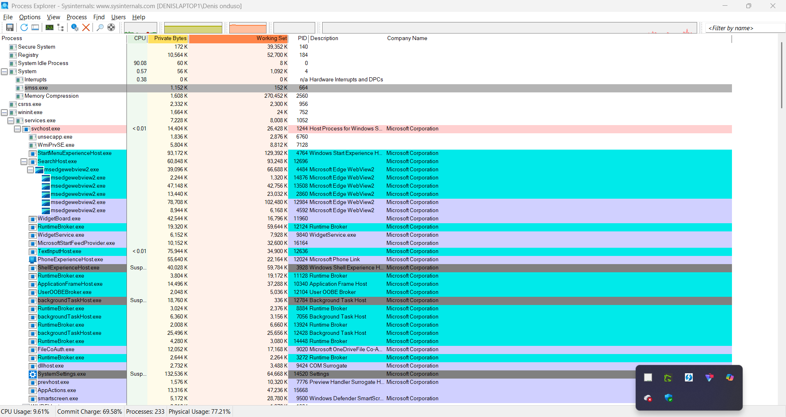

# Endpoint Forensics: Process & Thread Investigation with Sysinternals Process Explorer

**Analyst:** Denis O. Onduso  
**Focus:** Process hierarchy mapping, system process validation, DLL and handle inspection

---

## Objective

Use Sysinternals Process Explorer to map the full process tree of a live Windows endpoint, validate the integrity of critical system processes, and inspect thread-level activity — establishing the methodology used during endpoint triage in a SOC investigation.

---

## Environment

- Windows host with Sysinternals Suite deployed
- Process Explorer used for process tree visualization, image path verification, DLL inspection, and handle enumeration

---

## Analysis

### Process Hierarchy Mapping

Process Explorer was used to view the full parent-child process tree. Key observations:

- `services.exe` correctly spawned multiple `svchost.exe` instances — each hosting a distinct group of Windows services
- All `svchost.exe` instances ran from `C:\Windows\System32\svchost.exe` with `-k` flags identifying their service group (e.g. `-k NetworkService`, `-k LocalSystemNetworkRestricted`)
- No orphaned processes detected — every running process had a traceable, legitimate parent

Orphaned processes (those whose parent PID no longer exists or points to an unexpected process) are a persistence indicator worth flagging during triage. None were present in this baseline capture.

### Critical Process Validation: `lsass.exe`

| Attribute | Expected | Observed | Status |
|-----------|----------|----------|--------|
| Image path | `C:\Windows\System32\lsass.exe` | `C:\Windows\System32\lsass.exe` | ✓ Clean |
| Instance count | 1 | 1 | ✓ Clean |
| Parent process | `wininit.exe` | `wininit.exe` | ✓ Clean |
| Network connections | None (local only) | None | ✓ Clean |

Multiple instances, a misspelled name (`lsasss.exe`, `lsass .exe`), or a path outside `System32` are all masquerading indicators. This process is a frequent target because of its access to credential material in memory.

### User-Mode Process Inspection: Browser Execution

Microsoft Edge was launched and monitored through Process Explorer in real time:

- `msedge.exe` spawned a tree of child processes immediately on launch — separate renderer, GPU, and utility processes are normal for Chromium-based browsers
- Thread count increased dynamically as tabs and extensions loaded
- DLL inspection revealed standard browser dependencies (`ntdll.dll`, `kernel32.dll`, `d3d11.dll` among others) — no unsigned or out-of-path DLLs observed
- Handle enumeration showed active file handles to the user profile and cache directories, consistent with expected browser behavior

This workflow — launching a process and immediately inspecting its DLLs and handles — directly mirrors the triage step taken when a suspicious process is flagged in a SOC alert.

---

## Key Findings

The endpoint showed a clean process tree with no masquerading, no orphaned processes, and no unsigned DLLs loaded by monitored processes. The browser process behaved as expected. This baseline documents what a healthy Windows endpoint looks like under Process Explorer — the reference point against which anomalies are measured.

---

## Forensic Reference

| Capability | Investigative Use |
|------------|-------------------|
| Tree View | Map process lineage; detect unauthorized or unexpected spawns |
| Image Path Verification | Identify masquerading — malware mimicking system process names or locations |
| DLL Inspection | Detect DLL hijacking or injection of unsigned/malicious libraries |
| Handle Search | Identify which files or registry keys a process has open |
| Thread Inspection | Spot anomalous CPU usage or injected threads from external processes |

---

## Tools

- **Sysinternals Process Explorer** — process tree, DLL view, handle enumeration, thread inspection
- **Windows Command Line** — tool execution and path verification

---

## MITRE ATT&CK Relevance

| Technique | ID | Relevance |
|-----------|----|-----------|
| Process Discovery | T1057 | Mapping running processes and their hierarchy |
| Masquerading | T1036.005 | lsass.exe path and instance count validation |
| DLL Side-Loading | T1574.002 | DLL inspection to detect unexpected library loads |
| Process Injection | T1055 | Thread inspection baseline for detecting injected execution |

*Process tree view showing legitimate system service lineage under services.exe*
